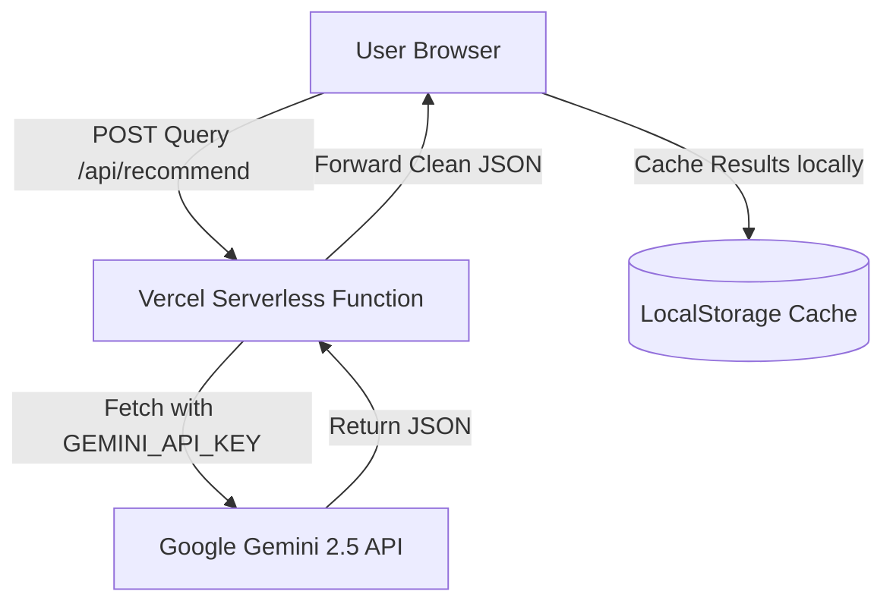

# VibeVault Project Walkthrough & Memory

This file serves as a permanent memory of the architectural decisions, features, and fixes implemented during the VibeVault Progressive Web App (PWA) development. Any future AI agent or developer should read this file to immediately understand the project state.

---

## 1. Project Overview & Rebranding
* **Original Name:** VibeMatch
* **Current Name:** VibeVault
* **Concept:** An AI-powered literary and cultural curation engine. Instead of standard genre-matching, it analyzes the "vibe", core tropes, and tone of a user's query (book, movie, TV show, game) and recommends 5–10 items from different media categories matching that exact mood.

---

## 2. Architecture & Tech Stack
VibeVault is designed as a secure, fast, single-page application deployed on **Vercel** with a serverless backend proxy to protect API keys.

* **Frontend:** Vanilla HTML5, JavaScript (ES6), and Tailwind CSS (utility classes via Play CDN).
* **Backend:** Node.js Serverless Function (`api/recommend.js`) acting as a proxy.
* **Database:** Zero-DB setup. User favorites are stored persistently in the browser's `localStorage`.
* **AI Model:** `gemini-2.5-flash` via Google AI Studio API.



---

## 3. Key Implemented Features

### ⚡ Caching System (Local Quota Protection)
* **Goal:** Prevent repetitive searches from consuming the Google Gemini API free-tier quota (15–20 Requests Per Minute).
* **Mechanism:** Implemented an LRU-like local cache (`vibeVaultSearchCache` in `localStorage`) holding up to **50 entries**. If a query is repeated (e.g., "Dune" in English or Turkish), results are served instantly in milliseconds without hitting the API.

### 🛡️ Safety Override & Robust Parsing
* **Scythe Issue Resolution:** Queries about dark, dystopian, or sci-fi themes (e.g., "Scythe" by Neal Shusterman) originally triggered Google's default safety block filters.
* **Fixes:**
  1. Configured `safetySettings` in the Gemini payload to block only high-risk content (`BLOCK_NONE` thresholds for creative topics).
  2. Implemented a robust markdown-cleaning regex parser on both the server and client-side to safely strip any wrapper backticks (e.g., ` ```json `) returned by the LLM before calling `JSON.parse()`.

### 📱 Responsive Layout & Mobile UI
* **Non-stretching Loader:** Previously, loading microcopy was rendered inside the search button, stretching the input bar on mobile screens. We moved the `loading-text` container *below* the search input block, making it a centered, pulse-animated (`animate-pulse`) indicator that never breaks the layout.
* **Unified Icons:** Standardized all icons (book, TV show, movie, game, board game) under the same design language using Lucide-style SVGs with a uniform `stroke-width="2"`.
* **New Search Navigation:** Renamed "Go Back" flows to "New Search" (Yeni Arama) and added a secondary "Yeni Arama Yap" button at the bottom of the recommendations grid for ease of mobile scrolling.

### ⏳ Theme-Aligned Loader
* Replaced the standard browser spinner with an **antique-style hourglass SVG** inside the search button, spinning at a relaxed, atmospheric speed of **3 seconds per rotation** (`.animate-spin-slow`) to match the vault/library theme.

---

## 4. Diagnostics & Troubleshooting Reference

### Console Cleanups
* **Tailwind CDN Warnings:** To keep the console clean in production, we implemented an interceptor wrapping `console.warn` that suppresses the warning `cdn.tailwindcss.com should not be used in production`.
* **Service Worker CORS Errors:** The `sw.js` (PWA Service Worker) was throwing CORS errors when trying to pre-cache third-party CDNs (Tailwind and cdnfonts). We restricted `sw.js` pre-caching to **local assets only** (`index.html`, `manifest.json`, `icon.svg`).
* **Logo Font 500 Errors:** Swapped out the unreliable `biarty` cdnfont with Google Fonts' **Space Grotesk** for the brand logotip.

### Monitoring & Analytics
* **Web Analytics:** Vercel Web Analytics is active via the script tag in the `<head>` of `index.html`.
* **Speed Insights:** Real User Monitoring (RUM) is enabled via Vercel Agent.

---

## 5. Development Cheat Sheet

### File Directory
* `index.html` - Complete client frontend and routing.
* `api/recommend.js` - Serverless Node proxy query route.
* `sw.js` - Progressive Web App Service Worker for offline asset caching.
* `manifest.json` - PWA app installation metadata.
* `icon.svg` - App logo, favicon, and shortcut icon.
* `package.json` - Configures `"type": "module"` for Native ESM build on Vercel.

### How to Deploy
Just commit changes and push to `main` branch:
```bash
git add .
git commit -m "feat: description of changes"
git push origin main
```
Vercel automatically triggers a build and publishes the changes to `https://vibe-vault-six.vercel.app/`.
